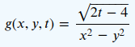

# Práctica 08. Funciones

# Factor de ponderación: 7

### Objetivos
Los objetivos de esta práctica son que el alumnado:
* Sea capaz de resolver problemas sencillos en C++ usando todos los conocimientos adquiridos hasta ahora, 
  y en particular utilizando funciones
* Diseñe, desarrolle y utilice funciones en sus programas haciendo que sus programas sean modulares
* Conozca la herramienta CMake y sea capaz de usarla a nivel básico para construir sus programas ejecutables

### Rúbrica de evaluacion de esta práctica
Se señalan a continuación los aspectos más relevantes (la lista no es exhaustiva) que se tendrán en cuenta a la hora de evaluar esta práctica.
Se comprobará que el alumnado:
* Conoce los conceptos expuestos en el material de referencia de esta práctica.
* Ha realizado todos los ejercicios propuestos en este enunciado
* Es capaz de escribir programas simples en C++ que resuelvan problemas de complejidad similar a los que se proponen en este documento
* Es capaz de escribir un fichero `CMakeLists.txt` para automatizar el proceso de compilación de sus programas con `cmake` y `make`
* Ha automatizado la compilación de sus programas usando un fichero `Makefile` para cada uno de los programas que desarrolle 
* Hace que sus programas se estructuren en torno a diferentes funciones (sean modulares)
* Todos sus programas se estructuran en directorios diferentes para cada "proyecto" haciendo que cada uno de
  ellos contenga un fichero `CMakeLists.txt` con la configuración de despliegue del proyecto.
* Utiliza en todos sus programas comentarios adecuados en el formato requerido por
[Doxygen](https://www.doxygen.nl/index.html)
* Acredita que todas las prácticas realizadas hasta la fecha se encuentran alojadas en repositorios privados de 
[GitHub](https://github.com/).
* Acredita que es capaz de subir programas a la plataforma 
[Jutge](https://jutge.org/)
para su evaluación
* Ha incluido un comentario prólogo en todos los ficheros (`*.cc`, `*.h`) de sus ejercicios
* Que todos los programas que desarrolla, antes de su ejecución imprimen en pantalla un mensaje indicando la 
  finalidad del programa así como la información que precisará del usuario para su correcta ejecución.
* Hace que todos los programas que se presentan para su evaluación cumplan con los estándares definidos en la
[Guía de estilo de Google para C++](https://google.github.io/styleguide/cppguide.html) 
* Utiliza siempre identificadores significativos en su programa (para constantes, variables, etc.) y
  no utiliza nunca identificadores de una única letra, tal vez con la excepción de las variables que utilice para iterar en un bucle.
* Acredita que es capaz de editar ficheros remotos en su VM usando vi
* Ha realizado todos sus ejercicios en la máquina virtual Ubuntu de la asignatura.
* Demuestra que es capaz de ejecutar comandos Linux en su VM

### Programas con múltiples ficheros de código
Conforme los programas se hacen más grandes, es habitual descomponer el programa en varios ficheros (módulos) con fines organizativos o de reutilización
del código.
En un proyecto real de desarrollo de software es común que los programas estén compuestos por cientos o miles
de ficheros de código fuente.
Estudie en el tutorial de referencia los apartados:
* [2.7 — Forward declarations and definitions](https://www.learncpp.com/cpp-tutorial/forward-declarations/)
* [A multi-file example](https://www.learncpp.com/cpp-tutorial/programs-with-multiple-code-files/)
de la sección 2.8 del tutorial (omita la parte introductoria relativa a los IDEs).
* [2.11 — Header files](https://www.learncpp.com/cpp-tutorial/header-files/)

Considere a continuación, como un ejemplo adicional el programa que hallará en el directorio
[headerSourceSeparation](https://github.com/IB-2022-2023/IB-class-code-examples/tree/master/Tools/cmake/headerSourceSeparation)
de los ejemplos de código de la asignatura.

Ese programa se compone de tres ficheros: `main.cc`, `tools.cc` y `tools.h`.
El fichero `Makefile` en ese directorio permite compilar el programa. 
Ejecute `make` y observe los comandos que se ejecutan para la compilación.
Examine a continuación el código de todos esos ficheros.
El programa principal simplemente invoca las funcionas *MakeItRain()* y *MakeItSunny()*.
Esas funciones se encuentran definidas en el fichero `tools.cc` y sus declaraciones (también llamadas
prototipos) se incluyen en el fichero `tools.h`.
Cualquier módulo (fichero `*.cc` con código) que precisara utilizar estas funciones deberá incluir (como se
hace en `main.cc`) el fichero `tools.h` donde se declaran dichas funciones.

Esto no es ni más ni menos que lo que se ha venido haciendo con otros ficheros de cabecera, *header*:
Cualquier programa C++ que precise utilizar funciones matemáticas como *sin()*, *cos()*, *fabs()*, *exp()*,
etc. ha de incluir el fichero de cabecera `cmath` (`#include <cmath>`) que es donde se hallan las
declaraciones de esas funciones.
Análogamente en el fichero de cabecera `iostream` se hallan declaradas las clases y  funciones necesarias para
realizar operaciones básicas de entrada/salida.
En el caso de funciones de librería de C++ las definiciones no se encuentran en ficheros de código fuente
(`*.cc`) sino que su código binario, que se encuentra en una librería, es añadido al programa final por 
el enlazador (*linker*), como ya se ha estudiado.

La separación en diferentes ficheros de código que presenta este ejemplo académico es muy frecuente en
proyectos reales de programación, en los que como ya se ha dicho, suelen intervenir cientos o miles de
ficheros.
Utilizar herramientas como `make` para la compilación de este tipo de proyectos es fundamental para optimizar
el proceso de desarrollo.

### La herramienta `cmake`
[CMake](https://es.wikipedia.org/wiki/CMake)
es lo que se conoce como un sistema de metaconstrucción. 
No se utiliza para construir (generar, *build* en inglés) el programa ejecutable de una aplicación sino
que produce ficheros de proyecto nativos para la plataforma de destino. 
Por ejemplo, CMake en Linux generará un fichero Makefile; 
en Windows generará una solución para Visual Studio; 
en macOS generará un proyecto para XCode y así sucesivamente. 
Eso es lo que la palabra *meta* indica: CMake construye sistemas de construcción (*builders*). 
La herramienta `make` que ya se ha estudiado, es un sistema de construcción, posiblemente el más común, y así
en *Informática Básica* se utilizará CMake para construir un fichero Makefile con el que se compilará cada uno
de los proyectos (programas) que se desarrollen.

Un proyecto basado en CMake siempre contiene un fichero `CMakeLists.txt`
que describe cómo se estructura el proyecto, la lista de ficheros 
de código fuente que se ha de compilar, lo que CMake debe generar a partir de él y así sucesivamente. 
Se trata en definitiva de un fichero de configuración para la herramienta CMake.
CMake leerá las instrucciones de ese fichero y producirá el resultado deseado. 

Una característica positiva de CMake es el llamado "*out-of-source build*". 
Cualquier fichero requerido para la construcción final, incluyendo los ejecutables, 
será almacenado en un directorio de construcción separado, habitualmente llamado `build/`. 
Esto evita que el directorio de origen que contiene el código fuente contenga
ficheros no deseados y hace que sea fácil volver a empezar: sólo hay que eliminar 
el directorio destino de la compilación (el directorio `build/`) y listo.

CMake es una herramienta muy potente que admite multitud de opciones.
En 
[la documentación](https://cmake.org/cmake/help/latest/index.html) 
de la herramienta se pueden estudiar en profundidad estas opciones, pero para la utilización que se propone
realizar en *Informática Básica* bastará con que estudie detenidamente 
[este breve tutorial](https://www.internalpointers.com/post/modern-cmake-beginner-introduction).

En el directorio raíz del repositorio de esta práctica hallará un subdirectorio `fibonacci_sum` con el
siguiente contenido:
```
  fibonacci_sum
  ├── CMakeLists.txt             // Fichero de configuración para CMake
  ├── CMakeLists.txt.simpler     // Otro fichero de configuración más simple
  ├── doc                        // Documentación
  ├── fibonacci.Doxyfile         // Fichero de configuración para Doxygen
  ├── LEE_ME.txt
  └── src                        // Código fuente de la aplicación
      ├── fibonacci_main.cc
      ├── fibonacci_sum.cc
      ├── fibonacci_sum.h
      ├── tools.cc
      └── tools.h
```
Esa estructura de directorios (a la que se añadirán los directorios `build/` -y opcionalmente `lib/`-)
es habitual en proyectos de desarrollo de software.
En este ejemplo se ha tomado la aplicación `fibonacci_sum` que calcula la suma de términos pares de la serie
de Fibonacci y se ha fragmentado la aplicación en 5 ficheros de código (`*.cc` y `*.h`).
El fichero de configuración `CMakeLists.txt` contiene la configuración que se utiliza para el despliegue de la
aplicación.
Al efecto de ilustrar este proceso, se crea una librería `libtools.a` que se aloja en el directorio `lib`. 
El programa binario (`fibonacci_sum`) se construye enlazando esta librería con el resto del código objeto
producto de la compilación.

Para construir la aplicación, siga los siguientes pasos (que son los habituales):
```
$ cd fibonacci_sum
$ mkdir build
$ cd build
$ cmake ..
$ make
```

El cuarto de esos comandos, `cmake`, usando el fichero de configuración `CMakeLists.txt`, creará en el 
directorio `build` el fichero `Makefile` que utiliza el comando `make` para construir la aplicación, 
cuyo programa binario `fibonacci_sum` se crea asimismo en el directorio `build`.

Experimente con este fichero de configuración entregado, `CMakeLists.txt` para adaptarlo a cada uno
de sus propios proyectos (ejercicios de prácticas).
No es necesario en principio, que construya librerías propias para sus programas.
La construcción de una librería se ha incluído en este ejemplo con la finalidad de ilustrar ese proceso.

El fichero `CMakeLists.txt.simpler` que se incluye es más simple que el anterior y en ese caso no genera la
documentación (Doxygen) del proyecto ni construye ninguna librería que se enlace con el programa final.
Puede utilizar este fichero (renombrándolo a `CMakeLists.txt`) como "plantilla" adaptándolo de ahora en 
adelante a cada uno de sus proyectos de programación en C++.

### Material de estudio complementario
Estudie todo lo que se indica en el epígrafe 
[Functions](https://google.github.io/styleguide/cppguide.html#Functions)
de la Guía de Estilo de Google y ponga en práctica todo lo que en ella se propone.
Es normal si encuentra en ese epígrafe algún contenido que aún no ha estudiado: no se preocupe. 
Centre su atención en aquellos aspectos que ya conozca, para consolidarlos.

Estudie del
[tutorial de referencia](https://www.learncpp.com/)
en la asignatura los siguientes apartados:
* [Local variables](https://www.learncpp.com/cpp-tutorial/local-variables/)
* [Introduction to global variables](https://www.learncpp.com/cpp-tutorial/introduction-to-global-variables/)
* [Variable shadowing (name hiding)](https://www.learncpp.com/cpp-tutorial/variable-shadowing-name-hiding/)
* [Scope, duration, and linkage summary](https://www.learncpp.com/cpp-tutorial/scope-duration-and-linkage-summary/)
* [Command line arguments](https://www.learncpp.com/cpp-tutorial/command-line-arguments/)

### Ejercicios
* Al realizar los ejercicios cree dentro de su repositorio de esta práctica un directorio diferente
para cada uno de los ejercicios.
Asigne a cada uno de esos directorios nombres significativos. 
* Automatice la compilación del programa correspondiente a cada ejercicio con un fichero `Makefile`
independiente para cada programa e inclúyalo en el correspondiente directorio.
* Haga que todos los programas tomen su entrada por la línea de comandos y en caso de que se ejecuten sin
  pasarles el número adecuado de parámetros impriman en pantalla un mensaje indicando el modo correcto de
  ejecutar el programa.
* El código de cada uno de los programas deberá organizarse de forma modular, es decir haciendo uso de funciones 
* Cada función deberá realizar una única tarea y hacerlo correctamente 
* El identificador de una función debe reflejar claramente lo que la función hace 

1. Escriba un programa `function-example.cc` que incluya una función C++ que realice el cálculo de 
la siguiente función matemática de tres variables:



```
Public test cases
Input           Output
3 4 5           -0.349927
4.0 1.0 7.0      0.210819
1 2 3           -0.471405
3 2 10.0         0.8
```

2. Escriba un programa `change-case.cc`que tome como entrada una cadena de caracteres sin espacios e imprima como salida la
misma cadena convirtiendo los caracteres que sean letras mayúsculas por minúsculas y viceversa.
Los caracteres que no sean letras mayúsculas ni minúsculas deberán permanecer inalterados.
Desarrolle su programa de forma que incluya como mínimo dos funciones y realice un diseño tal que el programa
se organice en más de un fichero de código fuente (`*.cc`).

```
Public test cases
Input           Output
Abecedario      aBECEDARIO
PyThon          pYtHON
AlFa2022        aLfA2022
```

3. Desarrolle un programa `random_numbers.cc` que tome como entrada dos números naturales `n` y `m` tales que `n < m` y genere
un número aleatorio real `r` en el intervalo `[n, m]`.

Desarrolle su programa de modo que incluya al menos dos funciones, y que sea una de ellas la que tome como
parámetros los dos números introducidos por el usuario y devuelva como resultado el número aleatorio.

Para generar números aleatorios en C++ consulte la función `std::rand` por ejemplo en 
[esta referencia](https://en.cppreference.com/w/cpp/numeric/random/rand).
 
Desarrolle un programa `random_numbers.cc` que tome como entrada dos números naturales `n` y `m` tales que n < m y genere un número aleatorio real r en el intervalo [n, m]. Para generar números aleatorios en C++ consulte la función std::rand por ejemplo en esta referencia.

4. Estudie el programa 
[`floating-point-arithmetics.cc`](https://github.com/IB-2022-2023/P08-functions/blob/main/floating-point-arithmetics.cc)
que se incluye en el directorio raíz del repositorio de esta práctica.
Ese programa define una constante de tipo double, `kOneThird` cuyo valor (0.333) debiera coincidir con el de
la fracción 1/3.
Si se imprimen ambos valores por separado, aparentemente son iguales, sin embargo si se utiliza la expresión
`1.0 / 3 == kOneThird` en una sentencia condicional, ésta resulta ser falsa.
Este comportamiento se debe a la imprecisión que introduce la representación de los números en punto flotante
en un ordenador.
Para profundizar en este fenómeno, estudie el artículo
[Problem in comparing Floating point numbers and how to compare them correctly?](https://www.geeksforgeeks.org/problem-in-comparing-floating-point-numbers-and-how-to-compare-them-correctly/)

Desarrolle a continuación una función cuya definición sea:
`bool AreEqual(const double number1, const double number2, const double epsilon = 1e-7);`
que devuelva `true` o `false` dependiendo de si los números que se le pasan como parámetro son aproximadamente
iguales o no.
El tercer parámetro, que por defecto vale `1e-7` indica un valor muy pequeño que la función tomaría como
margen de error a la hora de considerar si los números son o no iguales.
[Este artículo](https://www.tutorialspoint.com/floating-point-comparison-in-cplusplus)
de *Tutorials Point* o
[Esta
entrada](https://stackoverflow.com/questions/17333/what-is-the-most-effective-way-for-float-and-double-comparison/253874#253874)
de *StackOverflow* podrían resultarle útiles para desarrollar la función.

Pruebe el comportamiento de su función con diferentes pares de valores como entrada.

5. Escriba un programa `triangle-area.cc` que tome como entrada las longitudes `a`, `b` y `c`de los lados de
un triángulo y calcule su área utilizando la
[Fórmula de Herón](https://en.wikipedia.org/wiki/Heron%27s_formula).
Diseñe una función cuyo nombre sea *Area*, que implemente ese cálculo.

Los tres lados del triángulo, `a`, `b`, `c` deben satisfacer la desigualdad triangular: 
cada uno de los lados no puede ser más largo que la suma de los otros dos.
Diseñe una función *IsAValidTriangle* que determine si los lados introducidos por el usuario forman un
triángulo válido o no, y solo calcule su área en caso de ser válido

```
Public test cases
Input           Output
5 5 5            10.82
3 4 6             5.33
3.9 6.0 1.2      Not a valid Triangle
1.9 2 2           1.67
```
